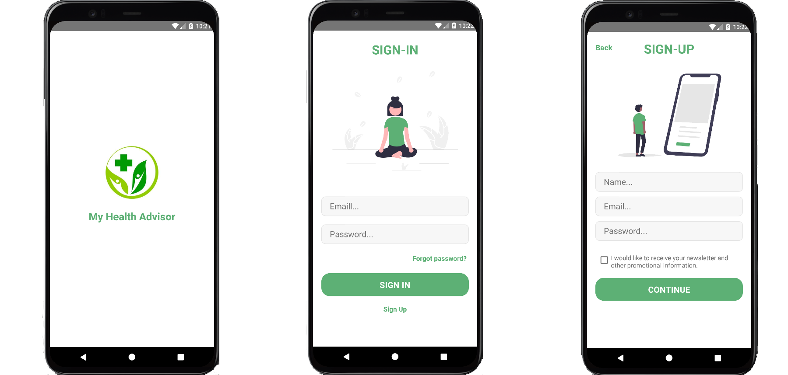
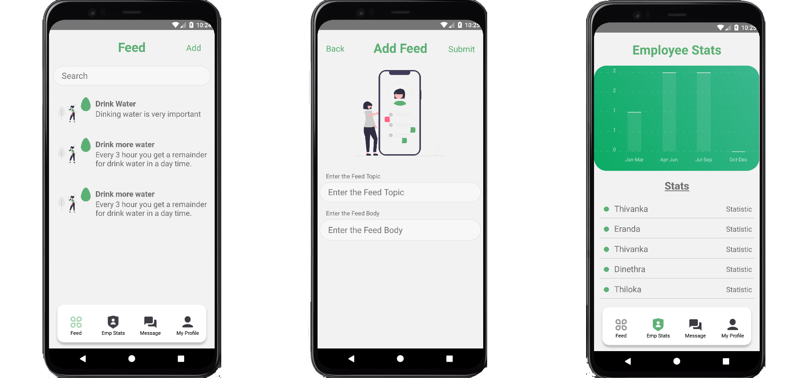
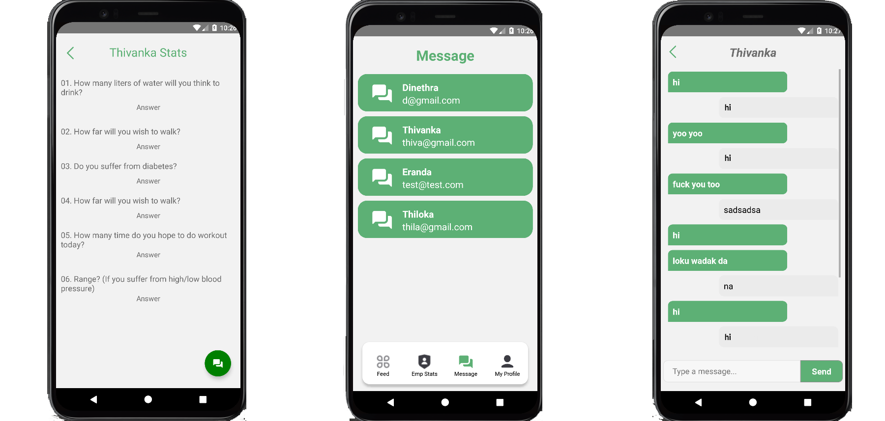
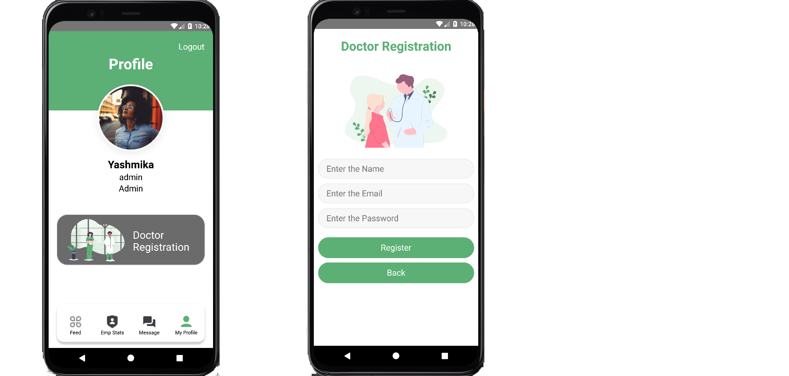
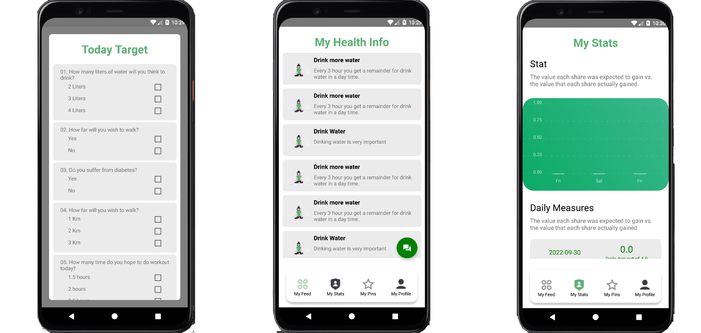
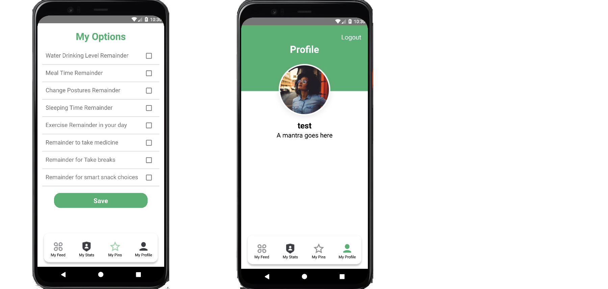

# Health-Care-App

This is a personal project which is conducted for education purposes. This project is a software application called Health Care App and is a Admin Side and Client Side of this project.

### Programming Language  

### Frontend Library

### Backend Library

### Database

### Admin Side & Client Side Common Interfaces

  

### Admin Side Interfaces

  

  

  

### Client Side Interfaces

  

  

